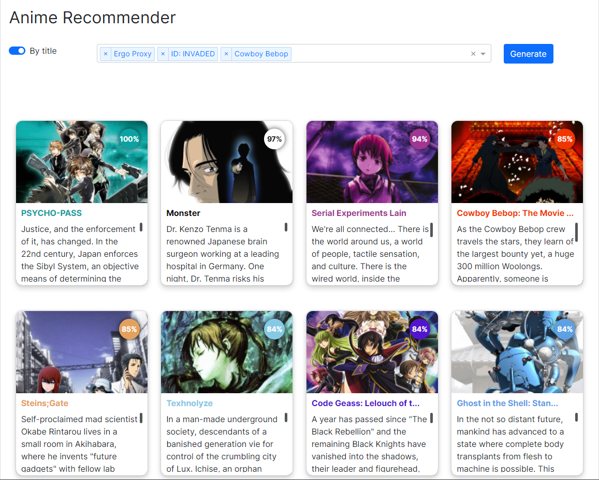
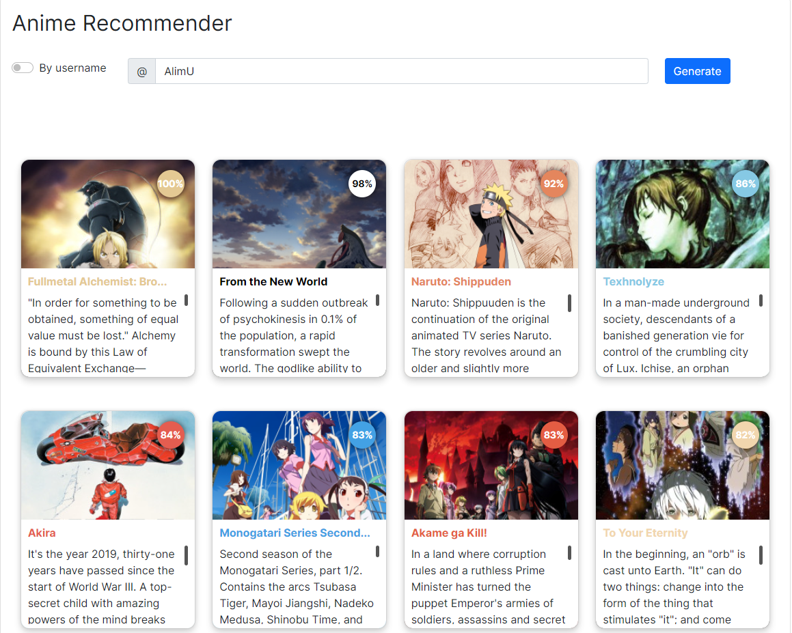

# Anime Recommender

> Web App: [https://alimu.pythonanywhere.com](https://alimu.pythonanywhere.com)

Parametrized anime recommendation system that produces recommendations based on
1. individual title or set of titles

2. user profile (refer to Current limitations section for further details)

# Roadmap
Key features in further releases (unordered, full details are in the [project page](https://github.com/users/AlimU11/projects/1)):
1. Add new recommendation engines
2. Improve UI - add dark theme, make responsive layout for mobile devices
3. Create weekly or monthly etl process to update data mart
4. Resolve current limitations (refer to `Current limitations` section for further details)
5. Add support for user profiles from other sites (MyAnimeList, Kitsu, etc.)
6. Create etl and data mart for manga

# Current limitations
1. User's lists - all titles in INCLUDED user's lists MUST HAVE scores
2. Score systems - other than ten-point score system was not yet tested
3. Only top 20 results are shown
4. Only titles with status 'Completed' at the moment of data scrapping (20.09 - 21.09) are taken into account from user profile and could be recommended
5. Only AniList user profiles supported
6. Further limitations might be mentioned in the [project page](https://github.com/users/AlimU11/projects/1)
