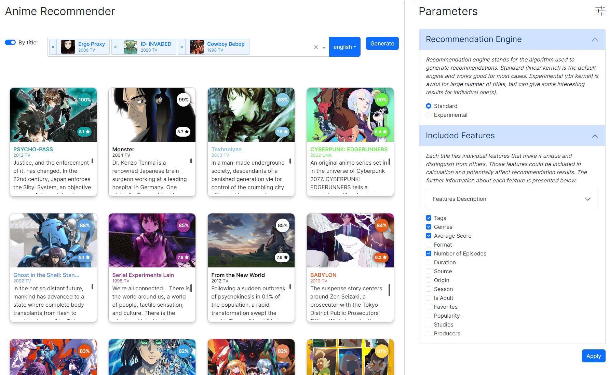

# Anime Recommender

> Web App: [https://anime-recommender-AlimU.pythonanywhere.com](https://anime-recommender-AlimU.pythonanywhere.com) (not currently mobile optimized)

Parametrized anime recommendation system that produces recommendations based on
1. individual title or set of titles

2. user profile (refer to Current limitations section for further details)


# Local Setup

1. Clone the repository
```bash
git clone https://github.com/AlimU11/Anime-Recommender.git
```
2. Install requirements from requirements.txt
```bash
pip install -r requirements.txt
```
3. Run `main_etl.py`
```bash
python main_etl.py
```
This will fetch the data from the source and save it in the `data` folder. This should take approximately 15 minutes. See
 ```bash
python main_etl.py -h
```
to run only chosen parts of the ETL process.

4. Run `main_local.py`
```bash
python main_local.py
```
This will start the local server with the app.

# File Structure

1. `anime_recommender` module - contains all the code for the app

2. `assets` - images used in README.md and NOTES.md. CSS and js for dash app

3. `notebooks` - notebooks used for data exploration and model development

4. `data` - folder with data used for the app. Not included in the repository due to its size. Could be easily recreated by running `main_etl.py

# Roadmap
Key features in further updates (unordered, full details are in the [project page](https://github.com/users/AlimU11/projects/1)):
1. Add new recommendation engines
2. Improve UI - add dark theme
3. <strike>Make responsive layout for mobile devices</strike> **Done** ✔️

4. <strike>Create weekly or monthly etl process to update data mart</strike> **Done** ✔️
5. Resolve current limitations (refer to `Current limitations` section for further details)
6. Add support for user profiles from other sites (MyAnimeList, Kitsu, etc.)
7. Create etl and data mart for manga

# Current limitations
1. User's lists - all titles in INCLUDED user's lists MUST HAVE scores
2. Score systems - other than ten-point score system was not yet tested
3. Only top 20 results are shown
4. <strike>Only titles with status 'Completed' at the moment of data scrapping (20.09 - 21.09) are taken into account and could be recommended</strike> <br>
Only titles with status 'Completed' at the moment of data update (every week on Monday at 04:00 UTC) are taken into account and could be recommended

5. Only AniList user profiles supported
6. Further limitations might be mentioned in the [project page](https://github.com/users/AlimU11/projects/1)
